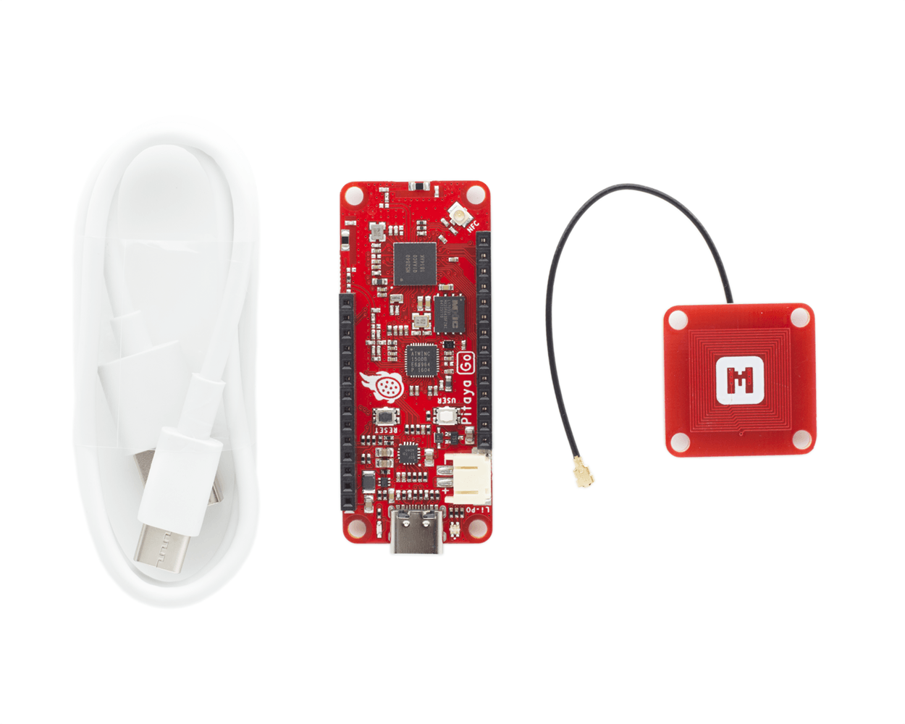
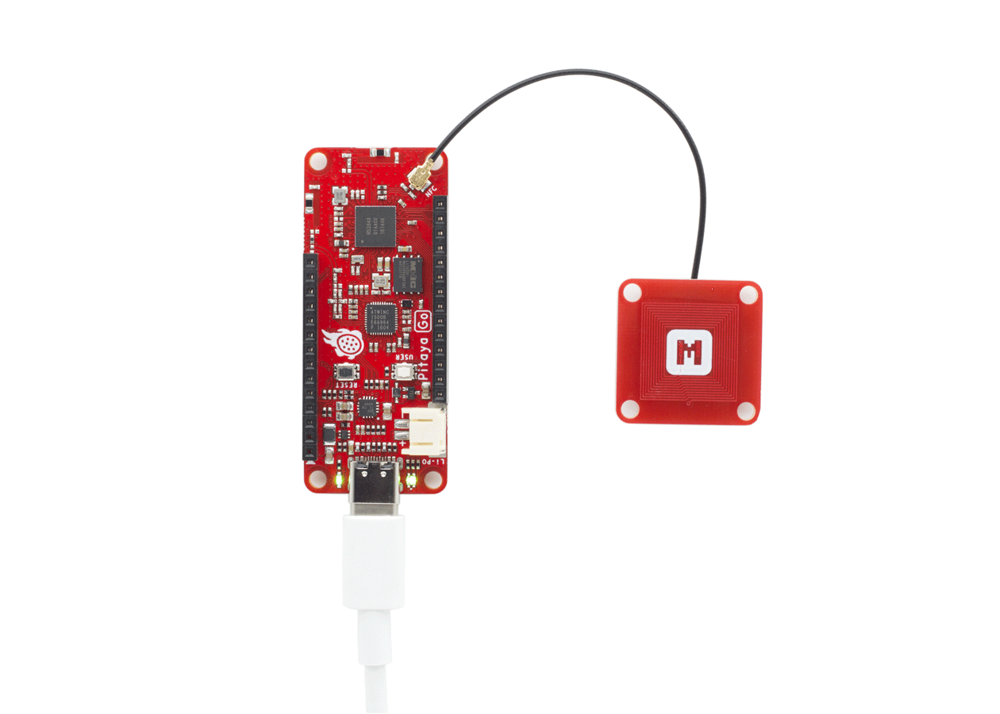
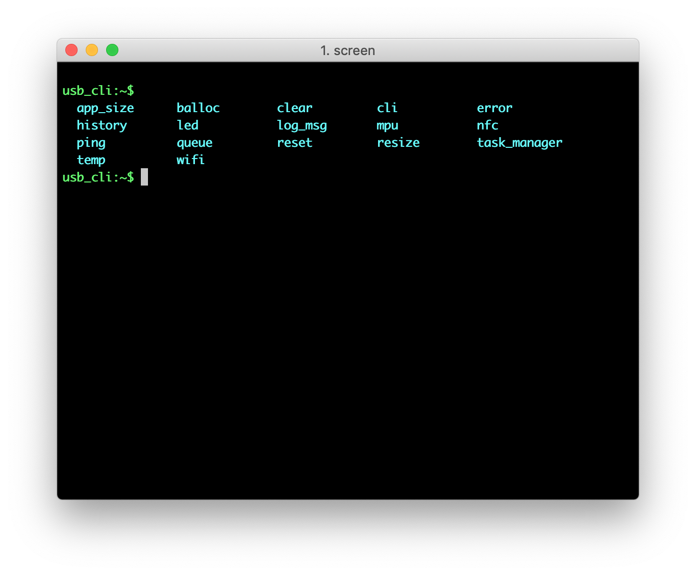
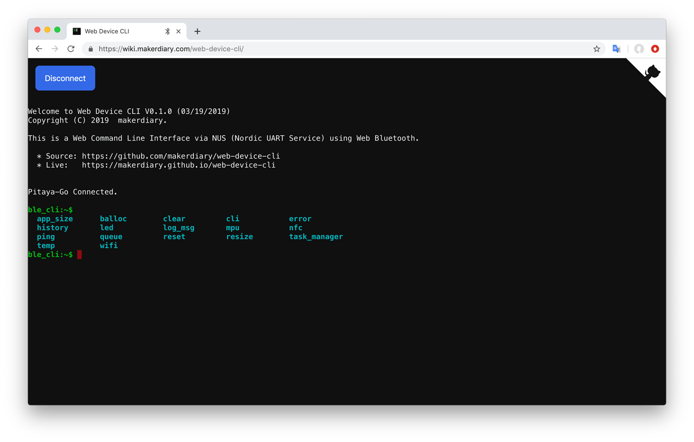
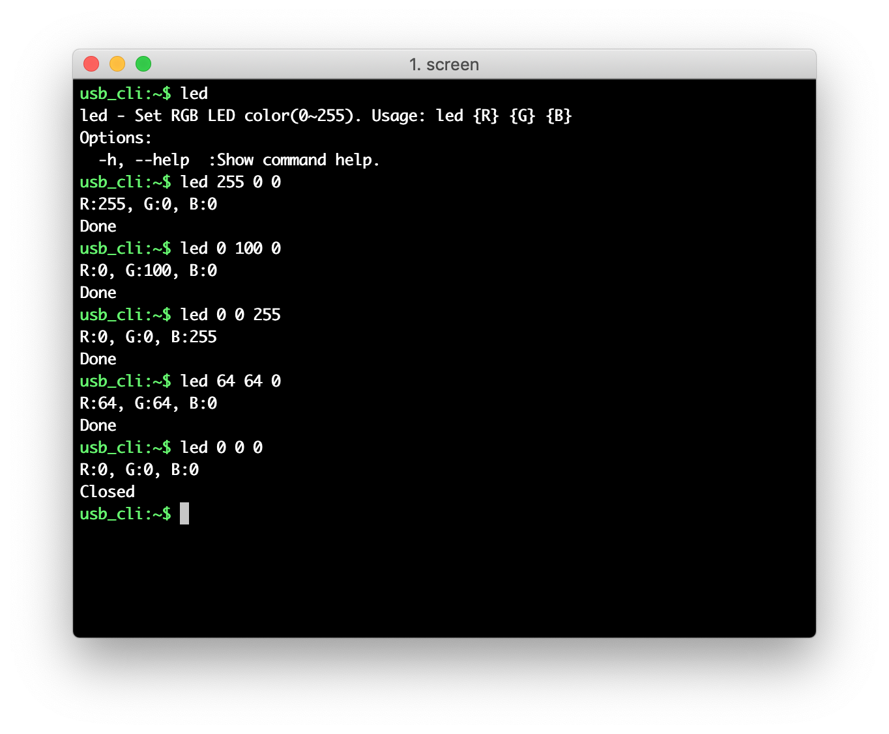
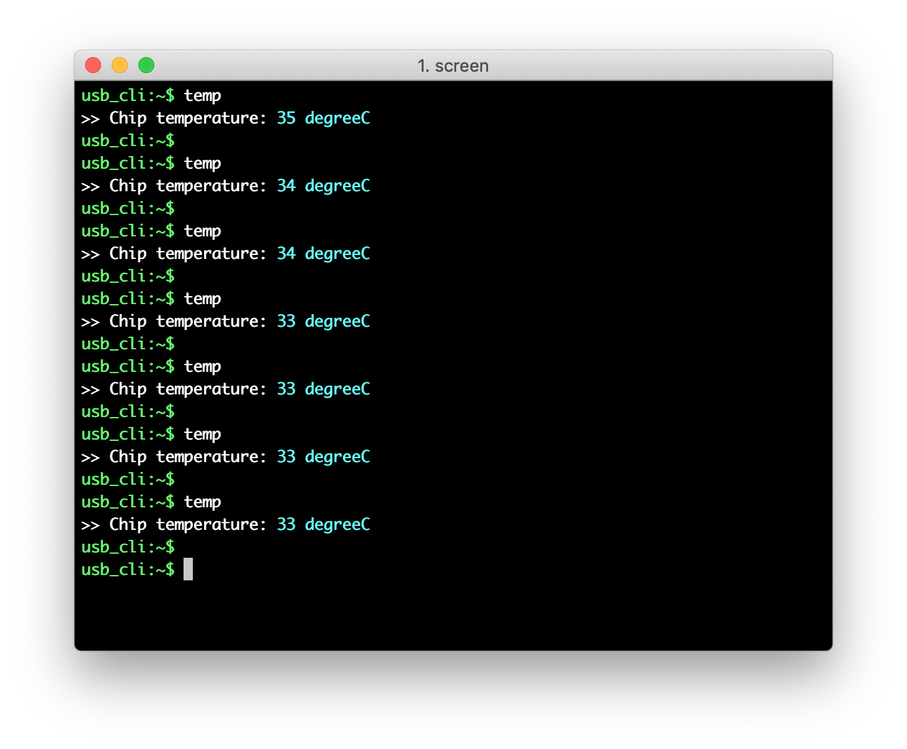
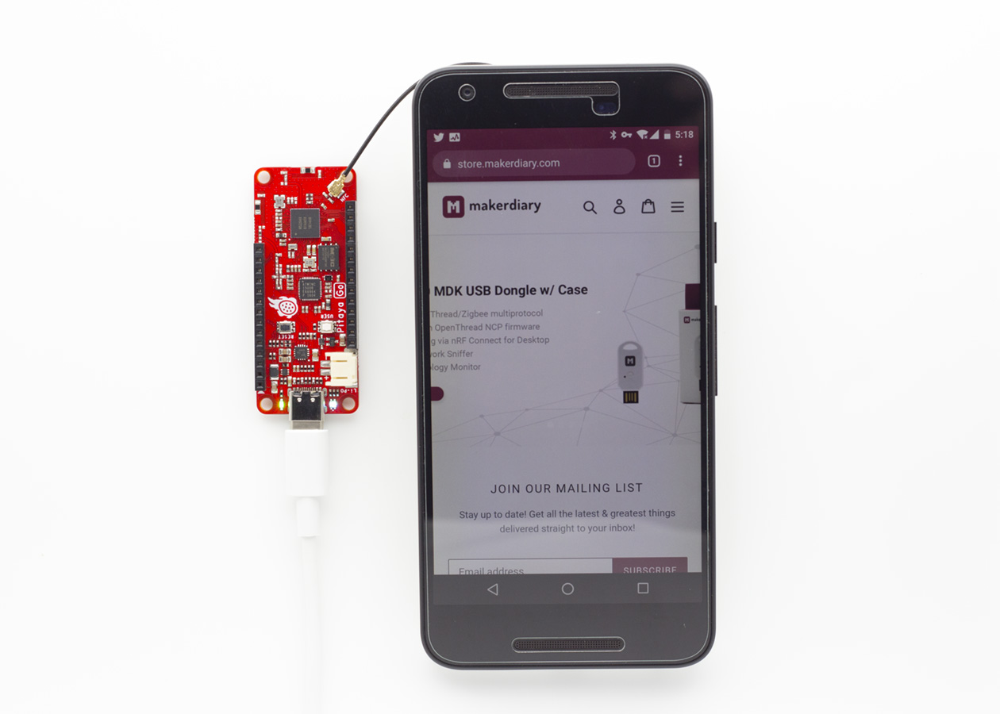
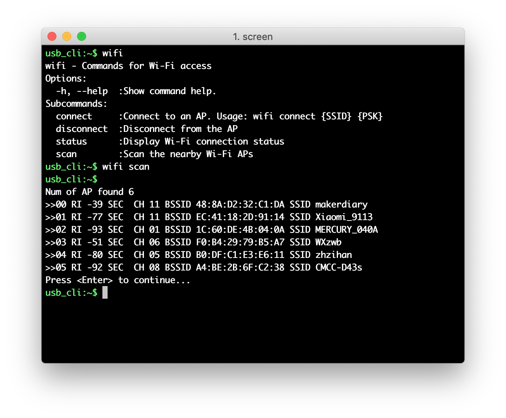
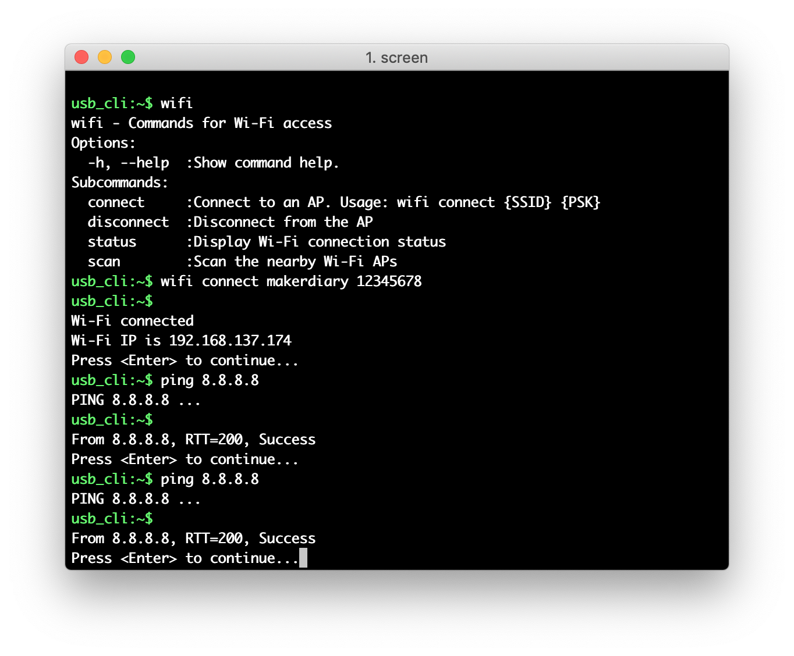

# Getting Started Out of the Box

## Introduction

This section describes how to run the Out of Box Demo without going through the complete toolchain installation.

The pre-installed demo running on the Pitaya Go board is controlled with Command Line Interface (CLI) over USB CDC ACM or Bluetooth Low Energy. You can set the LED color, get the chip temperature or control the NFC Tag, using the built-in commands. The application also allows you to connect Pitaya Go to a Wi-Fi network and ping a host in the public network.

## Included in the Box

Your Pitaya Go box includes:

* 1x Pitaya Go board
* 1x NFC-A PCB Antenna with MHF I connector
* 1x USB-C Cable



## Assemble the Hardware

1. Attach the NFC-A PCB Antenna to the U.FL connector. The connector is marked **NFC**.

2. Plug in the USB-C cable between your computer and the USB-C Connector.

3. Observe that the PG (Power Good) indicator is lit, and the RGB LED is blinking green.



## Set Up with Terminal

Terminal applications (for example [PuTTY](https://www.chiark.greenend.org.uk/~sgtatham/putty/) or [screen](https://www.gnu.org/software/screen/manual/screen.html)) run on your host PC. They provide a window where you can interact with the device.

1. Start a terminal application. The default setup for the USB serial port is 115200 baud, 8 bits, 1 stop bit, no parity (115200-8-N-1). For example:

	``` sh
	screen /dev/cu.usbmodemD2E39D222D781 115200
	```

	!!!Note
		If you are using Windows 7 or earlier, you must load an additional USB CDC driver. The driver can be found in [pitaya-go/external/usb_driver](https://github.com/makerdiary/pitaya-go/tree/master/external/usb_driver).

2. Press <kbd>Enter</kbd> on the keyboard to bring up the `usb_cli:~$` prompt.

3. Use the <kbd>Tab</kbd> key to print the available commands.

	

## Set Up with Web Device CLI

[Web Device CLI](https://github.com/makerdiary/web-device-cli) is a web-based command line interface using [Web Bluetooth API](https://webbluetoothcg.github.io/web-bluetooth/). It implements the Nordic UART Service (NUS) with Bluetooth Low Energy.

1. Open the [Web Device CLI](https://github.com/makerdiary/web-device-cli) page in a Chrome 56+ [browser](https://github.com/WebBluetoothCG/web-bluetooth/blob/master/implementation-status.md).

	<a href="https://wiki.makerdiary.com/web-device-cli/" target="_blank"><button data-md-color-primary="marsala">Web Device CLI</button></a>

2. Click <kbd>Connect</kbd> to scan devices.

3. Pair the **Pitaya-Go** discovered in the list.

4. Observe that the RGB LED stays GREEN and the `ble_cli:~$` prompt is displayed.

5. Use the <kbd>Tab</kbd> key to print the available commands.

	[](assets/images/set-up-with-web-device-cli.png)

## Set the LED Color

1. Use command `led` to print the command help information.

2. Use command `led {R} {G} {B}` to set the LED color. The parameters stand for the following:

	* `{R}`: The RED value, 0 ~ 255.
	* `{G}`: The GREEN value, 0 ~ 255.
	* `{B}`: The BLUE value, 0 ~ 255.

3. Set various RGB values and observe the color of LED.

	

## Get the Temperature

nRF52840 chip features a temperature sensor. The `temp` command is available for getting the chip temperature.



## Control the NFC Tag

1. Use command `nfc` to print the command help information.

2. Use command `nfc start` to enable the NFC.

3. Touch the NFC PCB Antenna with the smartphone and observe that BLUE LED is lit.

4. Observe that the smartphone tries to open the URL [https://makerdairy.com](https://makerdairy.com) in a web browser.

5. You can also use `nfc stop` to disable the NFC and use `nfc status` to check the NFC status.




## Connect to the Internet

Thie demo also allows you to connect to a Wi-Fi network via the CLI. Perform the following steps to connect to a Wi-Fi Access Point and check the Internet connectivity:

1. Use command `wifi` to print the command help information.

2. Use command `wifi scan` to the nearby Wi-Fi APs.

	

3. Use command `wifi connect {SSID} {PSK}` to connect to your AP. The parameters stand for the following:

	* `{SSID}`: The name of AP. If not specified, the device will attempt to reconnect to the last-associated AP.
	* `{PSK}`: The passphrase of AP. MUST be 8 characters or more. If it's an Open network, it can be left blank.

4. Observe that BLUE LED is lit, that is, the Wi-Fi is connected. Use command `wifi status` to retrieve the Wi-Fi connection status.

5. Use `ping {host}` to check the Internet connectivity. For example, ping Google’s DNS `8.8.8.8`:

	``` sh
	ping 8.8.8.8
	```

	

## Explore Further

Now that you are familiar with the Pitaya Go, it's time to explore more examples and tutorials available below:

* [How to Program Pitaya Go](programming.md)
* [nRF5 SDK Tutorials](nrf5-sdk/index.md)
* [Wi-Fi Tutorials](wifi/index.md)
* [OpenThread Tutorials](openthread/index.md)

## Create an Issue

Interested in contributing to this project? Want to report a bug? Feel free to click here:

<a href="https://github.com/makerdiary/pitaya-go/issues/new"><button data-md-color-primary="marsala"><i class="fa fa-github"></i> Create an Issue</button></a>
