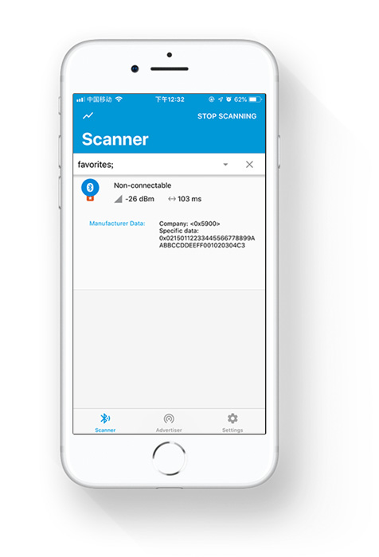

# BLE Beacon Example

## Description

The Beacon Example implements a transmitter beacon that broadcasts information to all compatible devices in its range as Manufacturer Specific Data in the advertisement packets.

This information includes:

* A 128-bit UUID to identify the beacon's provider.
* An arbitrary Major value for coarse differentiation between beacons.
* An arbitrary Minor value for fine differentiation between beacons.
* The RSSI value of the beacon measured at 1 meter distance, which can be used for estimating the distance from the beacon.

!!! Tip
	Before you start building, remember to set up the nRF5 SDK development environment first. See [Setup the nRF5 SDK](../setup-the-nrf5-sdk.md) for details.

## Building the example

You can find the source code and the project file of the example in the following folder: [pitaya-go/examples/ble/ble_app_beacon](https://github.com/makerdiary/pitaya-go/tree/master/examples/ble/ble_app_beacon).

Open terminal and navigate to the directory with the example Makefile:

``` sh
cd ./pitaya-go/examples/ble/ble_app_beacon/armgcc
```

Run `make` to build the example:

``` sh
make
```

## Programming the firmware

If compiled successfully, the firmware is located in `ble_app_beacon/armgcc/_build` with the name `nrf52840_xxaa.hex`.

While pushing the **USER** button, press the **RESET** button to enter the DFU mode. Then program the firmware using the [nRF Connect for Desktop](https://www.nordicsemi.com/Software-and-Tools/Development-Tools/nRF-Connect-for-desktop) tool.

If the SoftDevice is not programmed before, remember to add the SoftDevice. The SoftDevice is located in `<nRF5 SDK>/components/softdevice/s140/hex/s140_nrf52_6.1.0_softdevice.hex`.

!!! Tip
	See **[Programming](../../programming.md)** section for details about how to program your Pitaya Go.

## Testing

Test the Beacon Example with **nRF Connect** by performing the following steps:

1. After application starts, observe that GREEN LED is blinking. This indicates that the beacon is advertising.

2. After starting discovery in nRF Connect, observe that the beacon is advertising with its Bluetooth device address without a Device Name.

3. Tap the device to view the full advertisement data.



## Reference

* [iBeacon Resource from Apple Developer](https://developer.apple.com/ibeacon/)

## Create an Issue

Interested in contributing to this project? Want to report a bug? Feel free to click here:

<a href="https://github.com/makerdiary/pitaya-go/issues/new"><button data-md-color-primary="marsala"><i class="fa fa-github"></i> Create an Issue</button></a>

