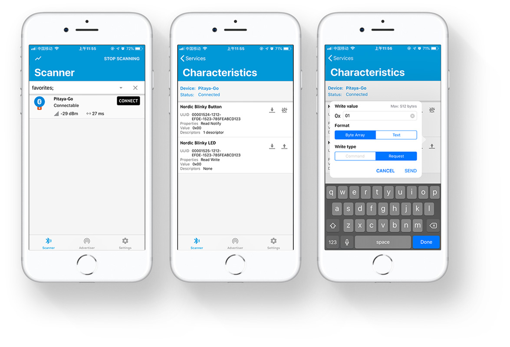

# BLE Blinky Example

## Description

The BLE Blinky Example uses the LED Button Service Server module. This module implements a custom LED Button Service with an LED and Button Characteristics that are used to toggle LEDs and receive button statuses from Pitaya Go.

!!! Tip
	Before you start building, remember to set up the nRF5 SDK development environment first. See [Setup the nRF5 SDK](../setup-the-nrf5-sdk.md) for details.

## Building the example

You can find the source code and the project file of the example in the following folder: [pitaya-go/examples/ble/ble_app_blinky](https://github.com/makerdiary/pitaya-go/tree/master/examples/ble/ble_app_blinky).

Open terminal and navigate to the directory with the example Makefile:

``` sh
cd ./pitaya-go/examples/ble/ble_app_blinky/armgcc
```

Run `make` to build the example:

``` sh
make
```

## Programming the firmware

If compiled successfully, the firmware is located in `ble_app_blinky/armgcc/_build` with the name `nrf52840_xxaa.hex`.

While pushing the **USER** button, press the **RESET** button to enter the DFU mode. Then program the firmware using the [nRF Connect for Desktop](https://www.nordicsemi.com/Software-and-Tools/Development-Tools/nRF-Connect-for-desktop) tool.

If the SoftDevice is not programmed before, remember to add the SoftDevice. The SoftDevice is located in `<nRF5 SDK>/components/softdevice/s140/hex/s140_nrf52_6.1.0_softdevice.hex`.

!!! Tip
	See **[Programming](../../programming.md)** section for details about how to program your Pitaya Go.

## Testing

You can test the example with the **nRF Connect** mobile app by performing the following steps:

1. Download the nRF Connect app from App Store or Google Play.

2. Connect to the device from nRF Connect (the device is advertising as **Pitaya-Go**).

3. Observe that RED LED is on and GREEN LED is off. This indicates that the connections is established.

4. Observe that the *LED Button Service* is shown in the connected device. It contains two characteristics: *Nordic Blinky Button* and *Nordic Blinky LED*.

5. Enable *Notify* on the *Nordic Blinky Button*. Notifications are received when pressing or releasing the USER Button.

6. Write `01` to the *Nordic Blinky LED* and observe that BLUE LED is turned on.

7. Write `00` to the *Nordic Blinky LED* and observe that BLUE LED is turned off.

[](assets/images/ble-app-blinky-example.jpg)

## Create an Issue

Interested in contributing to this project? Want to report a bug? Feel free to click here:

<a href="https://github.com/makerdiary/pitaya-go/issues/new"><button data-md-color-primary="marsala"><i class="fa fa-github"></i> Create an Issue</button></a>

