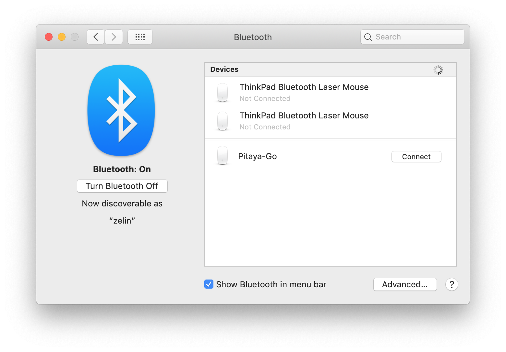

# BLE HID Mouse Example

The BLE HID Keyboard Example demonstrates how to implement the HID over GATT profile for mouse.

The application includes the three mandatory services needed for the HID over GATT profile:

* Human Interface Device Service
* Device Information Service
* Battery Service

!!! Tip
	Before you start building, remember to set up the nRF5 SDK development environment first. See [Setup the nRF5 SDK](../setup-the-nrf5-sdk.md) for details.

## Building the example

You can find the source code and the project file of the example in the following folder: [pitaya-go/examples/ble/ble_app_hids_mouse](https://github.com/makerdiary/pitaya-go/tree/master/examples/ble/ble_app_hids_mouse).

Open terminal and navigate to the directory with the example Makefile:

``` sh
cd ./pitaya-go/examples/ble/ble_app_hids_mouse/armgcc
```

Run `make` to build the example:

``` sh
make
```

## Programming the firmware

If compiled successfully, the firmware is located in `ble_app_hids_mouse/armgcc/_build` with the name `nrf52840_xxaa.hex`.

While pushing the **USER** button, press the **RESET** button to enter the DFU mode. Then program the firmware using the [nRF Connect for Desktop](https://www.nordicsemi.com/Software-and-Tools/Development-Tools/nRF-Connect-for-desktop) tool.

If the SoftDevice is not programmed before, remember to add the SoftDevice. The SoftDevice is located in `<nRF5 SDK>/components/softdevice/s140/hex/s140_nrf52_6.1.0_softdevice.hex`.

!!! Tip
	See **[Programming](../../programming.md)** section for details about how to program your Pitaya Go.

## Testing

Use a Laptop with Bluetooth Low Energy supported to test the HID Mouse Example. Here we use a MacBook Pro.

1. After the application starts, observe that GREEN LED is blinking. This indicates that the beacon is advertising.

2. Go to **System Preferences** -> **Bluetooth Preferences**, observe that the BLE HID Mouse named **Pitaya-Go** is found.

	

3. Connect to the mouse. Observe that GREEN constant light, that is, the connections is established.

4. Press USER button on the board. Observe that the mouse pointer on the screen moves to the left.


## Create an Issue

Interested in contributing to this project? Want to report a bug? Feel free to click here:

<a href="https://github.com/makerdiary/pitaya-go/issues/new"><button data-md-color-primary="marsala"><i class="fa fa-github"></i> Create an Issue</button></a>

