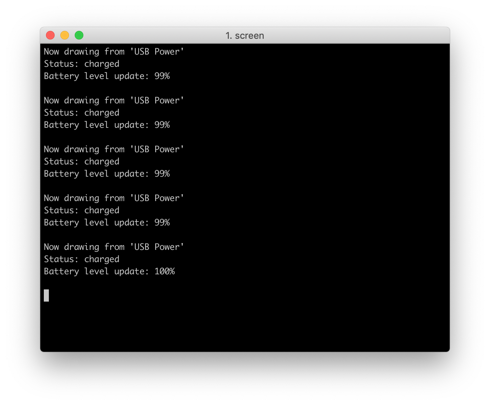

# Battery Status Example

## Description

The Battery Status Example shows how to get the status of the battery charger, including the battery level, charging state and power source.

The example initializes the SAADC driver and configures one channel to sample the voltage of the battery. Application Timer module is used to generate a timeout event. When the timer expires, the callback function will be called to print the measurement.

!!! Tip
	Before you start building, remember to set up the nRF5 SDK development environment first. See [Setup the nRF5 SDK](../setup-the-nrf5-sdk.md) for details.

## Building the example

You can find the source code and the project file of the example in the following folder: [pitaya-go/examples/peripheral/battery_status](https://github.com/makerdiary/pitaya-go/tree/master/examples/peripheral/battery_status).

Open terminal and navigate to the directory with the example Makefile:

``` sh
cd ./pitaya-go/examples/peripheral/battery_status/armgcc
```

Run `make` to build the example:

``` sh
make
```

## Programming the firmware

If compiled successfully, the firmware is located in `battery_status/armgcc/_build` with the name `nrf52840_xxaa.hex`.

While pushing the **USER** button, press the **RESET** button to enter the DFU mode. Then program the firmware using the [nRF Connect for Desktop](https://www.nordicsemi.com/Software-and-Tools/Development-Tools/nRF-Connect-for-desktop) tool.

!!! Tip
	See **[Programming](../../programming.md)** section for details about how to program your Pitaya Go.

## Testing

Test the example by performing the following steps:

1. Connect a 3.7V Li-Po battery with 2-pin JST-PH connector to the Battery connector.

2. Run a terminal application like [PuTTY](https://www.chiark.greenend.org.uk/~sgtatham/putty/) or [screen](https://www.gnu.org/software/screen/manual/screen.html):

``` sh
screen /dev/cu.usbmodemD2E39D222D781 115200
```

3. Observe that the battery status is printed every 2 seconds.



## Create an Issue

Interested in contributing to this project? Want to report a bug? Feel free to click here:

<a href="https://github.com/makerdiary/pitaya-go/issues/new"><button data-md-color-primary="marsala"><i class="fa fa-github"></i> Create an Issue</button></a>
