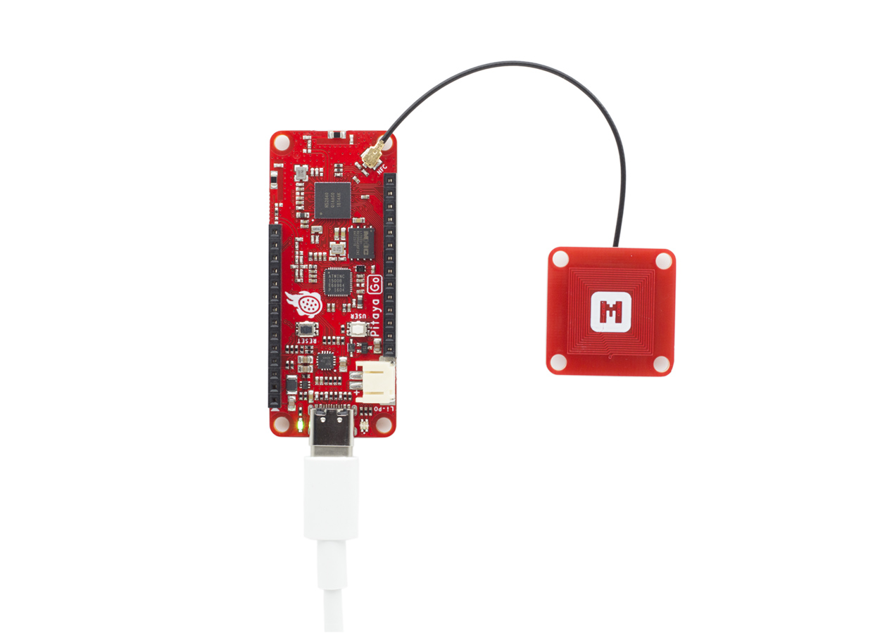

# NFC Tag Example

## Description

The NFC Tag Example demonstrates how to use the NFC tag to expose a URL record to NFC devices.

When the application starts, it initializes the NFC tag and generates a URI message with a URI record containing the URL `makerdiary.com`. Then it sets up the NFC library to use the generated message and sense the external NFC field. The only events handled by the application are the NFC events.

!!! Tip
	Before you start building, remember to set up the nRF5 SDK development environment first. See [Setup the nRF5 SDK](../setup-the-nrf5-sdk.md) for details.


## Building the example

You can find the source code and the project file of the example in the following folder: [pitaya-go/examples/peripheral/nfc/record_url](https://github.com/makerdiary/pitaya-go/tree/master/examples/peripheral/nfc/record_url).

Open terminal and navigate to the directory with the example Makefile:

``` sh
cd ./pitaya-go/examples/peripheral/nfc/record_url/armgcc
```

Run `make` to build the example:

``` sh
make
```

## Programming the firmware

If compiled successfully, the firmware is located in `nfc/record_url/armgcc/_build` with the name `nrf52840_xxaa.hex`.

While pushing the **USER** button, press the **RESET** button to enter the DFU mode. Then program the firmware using the [nRF Connect for Desktop](https://www.nordicsemi.com/Software-and-Tools/Development-Tools/nRF-Connect-for-desktop) tool.

!!! Tip
	See **[Programming](../../programming.md)** section for details about how to program your Pitaya Go.


## Testing

Test the NFC Tag Example with a smartphone or a tablet with NFC support by performing the following steps:

1. Connect the additional NFC PCB Antenna to Pitaya Go through the U.FL connector.

	


2. Touch the NFC PCB Antenna with the smartphone or tablet and observe that BLUE LED is lit.

3. Observe that the smartphone/tablet tries to open the URL `https://makerdairy.com` in a web browser.

4. Move the smartphone/tablet away from the NFC PCB Antenna and observe that BLUE LED turns off.


## One more example

There is another NFC Tag Example showing how to use the NFC tag to launch an app(such as Twitter) on an Android Phone that supports NFC. 

You can find the source code and the project file of the example in the following folder: [pitaya-go/examples/peripheral/nfc/record_launch_app](https://github.com/makerdiary/pitaya-go/tree/master/examples/peripheral/nfc/record_launch_app).

The steps to test this example should be similar as described above.

## Create an Issue

Interested in contributing to this project? Want to report a bug? Feel free to click here:

<a href="https://github.com/makerdiary/pitaya-go/issues/new"><button data-md-color-primary="marsala"><i class="fa fa-github"></i> Create an Issue</button></a>
