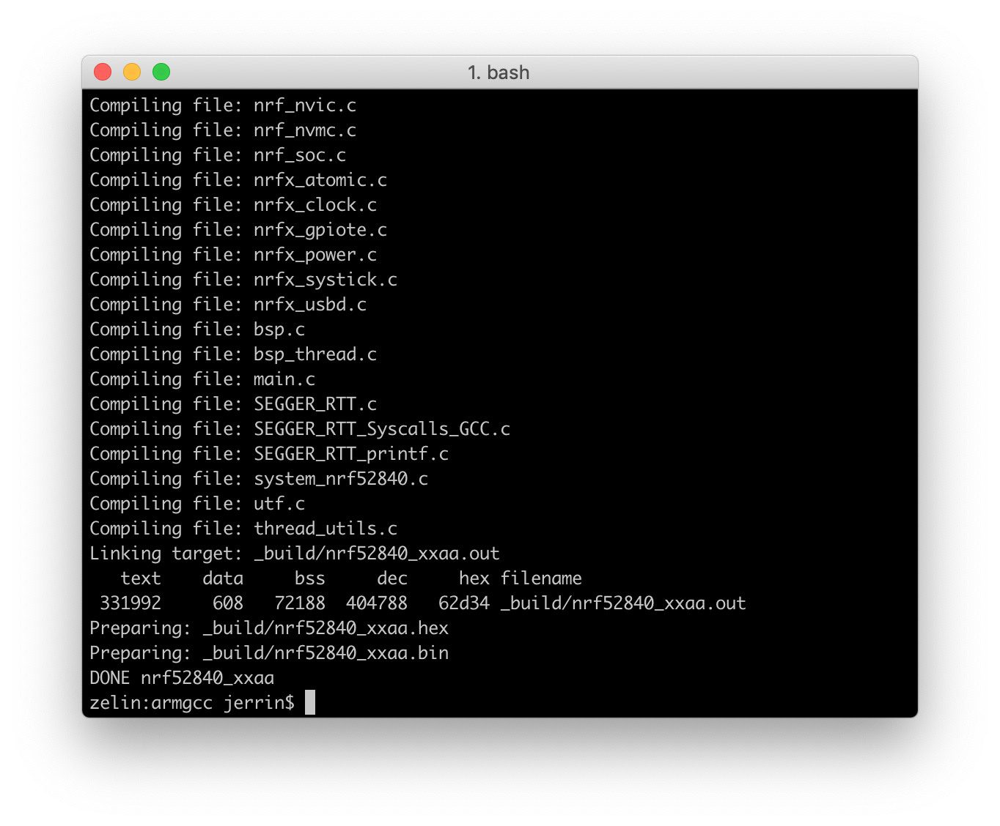

# Build and Run a Thread Example

This section demonstrates how to build a Thread example (like OpenThread CLI) with the nRF5 SDK for Thread and run it.

Before you start building, remember to set up the Thread development environment first. See [Setup the Thread SDK](setup-the-thread-sdk.md) for details.

## Building OpenThread CLI

You can find the source code and the project file of OpenThread CLI in the following folder: [pitaya-go/examples/openthread/cli](https://github.com/makerdiary/pitaya-go/tree/master/examples/openthread/cli).

Navigate to the directory with the OpenThread Full Thread Device (FTD) CLI Makefile:

``` sh
cd ./pitaya-go/examples/openthread/cli/ftd/armgcc
```

Run `make` to build the example:

``` sh
make
```



## Programming OpenThread CLI

If compiled successfully, the firmware is located in `openthread/cli/ftd/armgcc/_build` with the name `nrf52840_xxaa.hex`.

While pushing the **USER** button, press the **RESET** button to enter the DFU (Device Firmware Update) mode. Then program the firmware using the [nRF Connect for Desktop](https://www.nordicsemi.com/Software-and-Tools/Development-Tools/nRF-Connect-for-desktop) tool.

!!! Tip
	See **[Programming](../programming.md)** section for details about how to program your Pitaya Go.

## Testing

Perform the following steps to test the OpenThread CLI:

1. Run a terminal application like [PuTTY](https://www.chiark.greenend.org.uk/~sgtatham/putty/) or [screen](https://www.gnu.org/software/screen/manual/screen.html):

	``` sh
	screen /dev/cu.usbmodemD2E39D222D781 115200
	```

2. Press <kbd>Enter</kbd> on the keyboard to bring up the OpenThread CLI `>` prompt.

3. Generate, view, and commit a new Active Operational Dataset:

	``` sh
	> dataset init new
	Done
	> dataset
	Active Timestamp: 1
	Channel: 24
	Channel Mask: 07fff800
	Ext PAN ID: 57a7486ff74c8538
	Mesh Local Prefix: fda9:4820:7a9c:66ba/64
	Master Key: aa8da3931ffcbcb26c8b4b7c9b4114c1
	Network Name: OpenThread-4d92
	PAN ID: 0x4d92
	PSKc: 22537a67d4040e34848d6d82ca2c313c
	Security Policy: 0, onrcb
	Done
	> dataset commit active
	Done
	```

4. Bring up the IPv6 interface:

	``` sh
	> ifconfig up
	Done
	```

5. Start Thread protocol operation. Observe that the GREEN LED is lit.

	``` sh
	> thread start
	Done
	```

6. Wait a few seconds and verify that the device has become a Thread Leader:

	``` sh
	> state
	leader
	Done
	```

7. View IPv6 addresses assigned to the Thread interface:

	``` sh
	> ipaddr
	fda9:4820:7a9c:66ba:0:ff:fe00:fc00
	fda9:4820:7a9c:66ba:0:ff:fe00:8800
	fda9:4820:7a9c:66ba:4d7b:9ef4:cbdf:8cd3
	fe80:0:0:0:3c1d:5115:ccc5:6ba7
	Done
	```

## Next Steps

* Check out more [OpenThread examples](https://github.com/makerdiary/pitaya-go/tree/master/examples/openthread/).

* [Build an OpenThread Border Router with Raspberry Pi](openthread-border-router.md)

* [Visualize Thread Network Topology](thread-topology-monitor.md)

* [Build an OpenThread Network Sniffer](thread-network-sniffer.md) to sniff packets on a Thread network.


## Create an Issue

Interested in contributing to this project? Want to report a bug? Feel free to click here:

<a href="https://github.com/makerdiary/pitaya-go/issues/new"><button data-md-color-primary="marsala"><i class="fa fa-github"></i> Create an Issue</button></a>


