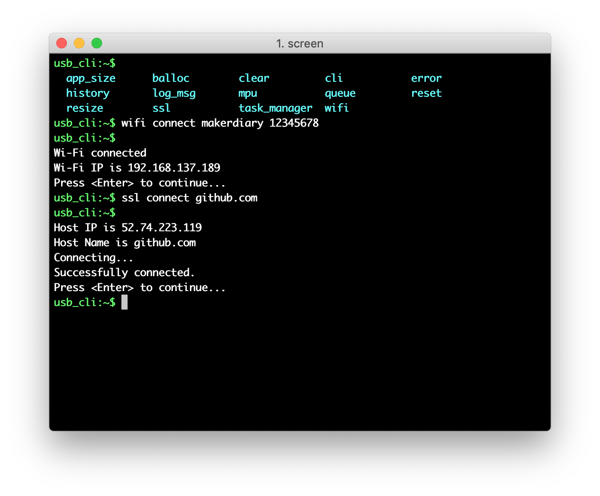
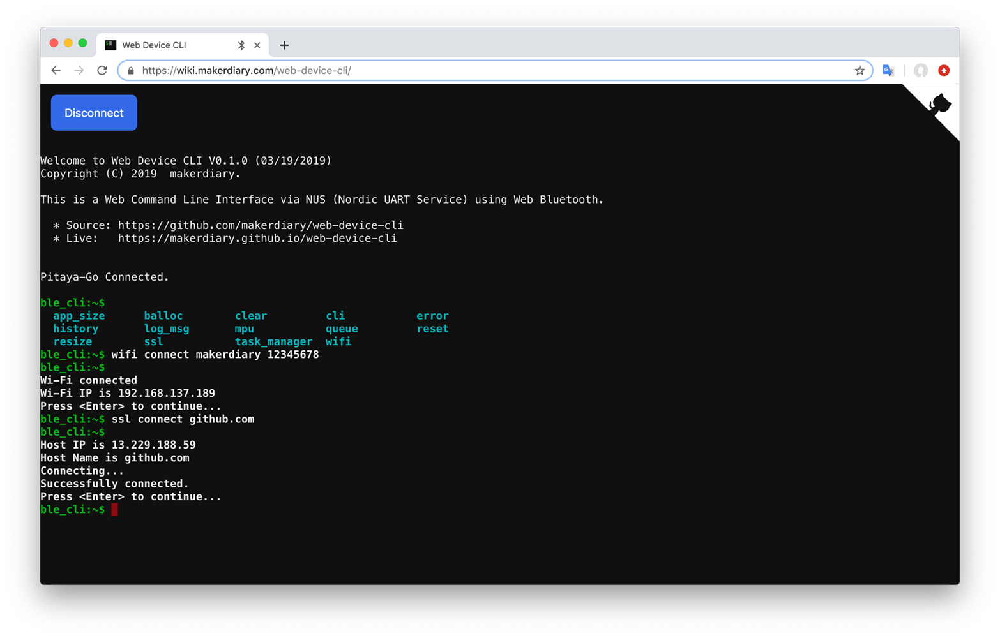

# SSL Client Connection Example

## Description

This example demonstrates how to set up an SSL connection with the Pitaya Go board.

This example also implements the Command Line Interface over BLE NUS and USB CDC ACM. Both consoles can be opened and used independently.

!!! Tip
	Before you start building, remember to set up the nRF5 SDK development environment first. See [Setup the nRF5 SDK](../../nrf5-sdk/setup-the-nrf5-sdk.md) for details.

## Building the example

You can find the source code and the project file of the example in the following folder: [pitaya-go/examples/wifi/ssl_connect_example](https://github.com/makerdiary/pitaya-go/tree/master/examples/wifi/ssl_connect_example).

Open terminal and navigate to the directory with the example Makefile:

``` sh
cd ./pitaya-go/examples/wifi/ssl_connect_example/armgcc
```

Run `make` to build the example:

``` sh
make
```

## Programming the firmware

If compiled successfully, the firmware is located in `ssl_connect_example/armgcc/_build` with the name `nrf52840_xxaa.hex`.

While pushing the **USER** button, press the **RESET** button to enter the DFU mode. Then program the firmware using the [nRF Connect for Desktop](https://www.nordicsemi.com/Software-and-Tools/Development-Tools/nRF-Connect-for-desktop) tool.

If the SoftDevice is not programmed before, remember to add the SoftDevice. The SoftDevice is located in `<nRF5 SDK>/components/softdevice/s140/hex/s140_nrf52_6.1.0_softdevice.hex`.

!!! Tip
	See **[Programming](../../programming.md)** section for details about how to program your Pitaya Go.

## Testing

The application is now programmed and running. Perform the following steps to test the SSL connection:

1. Run a terminal application like [PuTTY](https://www.chiark.greenend.org.uk/~sgtatham/putty/) or [screen](https://www.gnu.org/software/screen/manual/screen.html):

	``` sh
	screen /dev/cu.usbmodemD2E39D222D781 115200
	```

2. Press <kbd>Enter</kbd> in the terminal. A console prompt is displayed.

3. Use the <kbd>Tab</kbd> key to print the available commands.

4. Use command `wifi connect {SSID} {PSK}` to connect to your AP. The parameters stand for the following:

	* `{SSID}`: The name of AP. If not specified, the device will attempt to reconnect to the last-associated AP.
	* `{PSK}`: The passphrase of AP. MUST be 8 characters or more. If it's an Open network, it can be left blank.

5. Observe that BLUE LED is lit, that is, the Wi-Fi is connected.

6. Using command `ssl connect github.com` to connect to GitHub with SSL enabled. Observe that the status will display in the console.

	

7. You can also use the [Web Device CLI](https://wiki.makerdiary.com/web-device-cli/) application to test this example.

	<a href="https://wiki.makerdiary.com/web-device-cli/" target="_blank"><button data-md-color-primary="marsala">Web Device CLI</button></a>

[](assets/images/ssl-connect-example-web.png)

## Create an Issue

Interested in contributing to this project? Want to report a bug? Feel free to click here:

<a href="https://github.com/makerdiary/pitaya-go/issues/new"><button data-md-color-primary="marsala"><i class="fa fa-github"></i> Create an Issue</button></a>
